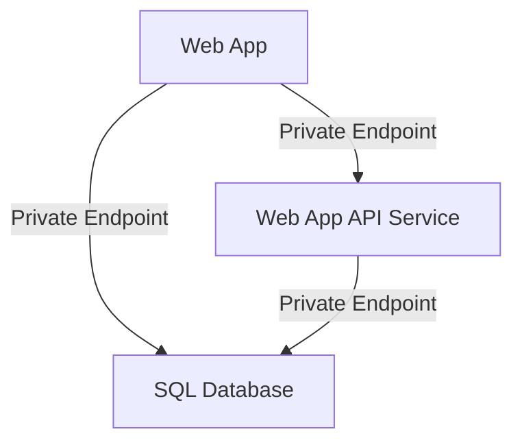

# Public Web App & Private Endpoints

A simple example of a Web App that uses a private API and Database with private Endpoints.

```mermaid
graph TD
    A[Web App] -->|Private Endpoint| B[Web App API Service]
    A -->|Private Endpoint| C[SQL Database]
    B -->|Private Endpoint| C
```