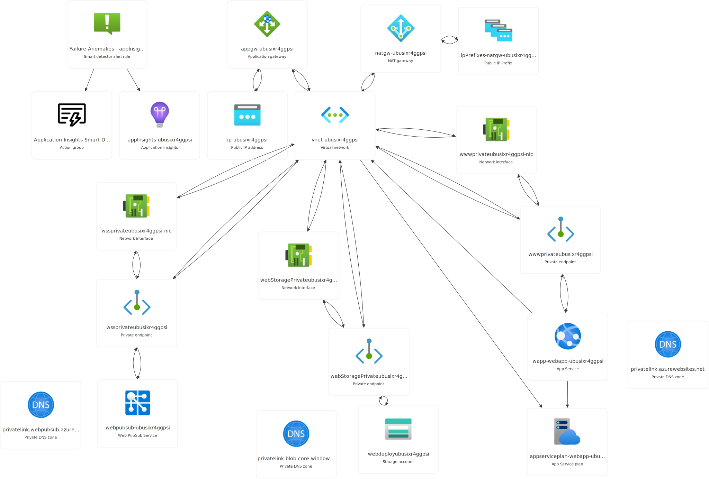

# README

This is a PoC  to use the Azure Web PubSub service to act as a WebSocket proxy for an OCPP 1.6 server. It demonstrates the
usage of a secured environment by using an Application Gateway connected to a private endpoint of the Web PubSub service, and
a private endpoint for the Web App that hosts the OCPP server.

## Requirements

You need:

* An **Azure KeyVault** with a wildcard certificate for the domain you will assign to the Application Gateway. The App Gateway uses it to publish the Web PubSub endpoint and the Web App.
* A **User Assigned Managed Identity** with read access to the KeyVault where the SSL certificate is stored.
* A **Public DNS Zone in Azure**, where the script will create or update the A records for the Web PubSub service. Your user needs modify permissions to these DNS records, and they will be created with a resource reference.
* A **main.parameters.bicepparam** file in the root of the project with the following content:

```bicep
using 'main.bicep'

param pubsubKeyVaultCertName = '<KeyVault name of the SSL Certificate for the pub sub service>'
param webKeyVaultCertName ='<KeyVault name of the SSL Certificate for the web test service, can be the same cert if you have a wildcard one>'
param keyVaultName = '<Name of the KeyVault>'
param keyVaultIdentityRG ='<NAME OF THE Managed Identity that has cert read access rights in the KeyVault>'
param customDnsZoneName ='<RESOURCE GROUP OF THE MANAGED IDENTITY>'
param pubsubARecordName ='<SUBDOMAIN NAME USED FOR THE WEB PUBSUB SERVICE, EX: wss (for wss.mydomain.com)>'
param dnsZoneRG ='<NAME OF THE RG WHERE THE DNS SERVICE>'
```

## (Optional) Configure Let's encrypt with your KeyVault and Azure DNS

If you don't have a certificate, you can use the Let's Encrypt service to generate a free certificate for your domain. [This amazing project](https://github.com/shibayan/keyvault-acmebot/wiki/Getting-Started) automates the process of generating the certificate and merging it into your KeyVault. Just follow the instructions, configure the permissions and create a certificate for your domain.

## Project Structure

The project is divided into two main parts:

* Infra: Contains the Bicep templates to deploy the Azure resources.
* Api: Contains the OCPP server implementation.

All these parts are managed by a Makefile that orchestrates the deployment and the compilation of the OCPP server.

## How to deploy this project into Azure

You can run the `deploy` *make* recipe with the following optional parameters:

```bash
make deploy [RG_NAME=<RESOURCE GROUP NAME>] [LOCATION=<LOCATION>] [APP_NAME=<APP NAME>]
```

This makefile recipe deploys the infra into your Azure subscription, compiles the OcppServer source code and publishes it into the created App Service via a private Storage Account. It doesn't use the direct zip upload method because the Web App is protected with a Private Endpoint, and the *az cli* cannot upload the zip file directly to the service.

The App Service and Web Pub Sub endpoints are protected with Private Endpoints, and published through an Application Gateway.



## FAQ

## The client fails with UNABLE_TO_VERIFY_LEAF_SIGNATURE

If you merged your certificate in KeyVault using a PEM or PFX format, you may need to create the CSR again, generate a new certificate and merge it in p7b format. Take a look to this FAQ section: [Create and merge a certificate signing request in Key Vault](https://learn.microsoft.com/en-us/azure/key-vault/certificates/create-certificate-signing-request?tabs=azure-portal#faqs)

After renewing the certificate, you can deploy the infra again with the new certificate, or reconfigure the App Gateway to use the new certificate in the **Listeners TLS Certificates** section.

Example error in the nodejs client:

```js
node:events:495
      throw er; // Unhandled 'error' event
      ^

Error: unable to verify the first certificate
    at TLSSocket.onConnectSecure (node:_tls_wrap:1659:34)
    at TLSSocket.emit (node:events:517:28)
    at TLSSocket._finishInit (node:_tls_wrap:1070:8)
    at ssl.onhandshakedone (node:_tls_wrap:856:12)
Emitted 'error' event on WebSocket instance at:
    at emitErrorAndClose (/home/jmservera/source/miscdemos/ocpp-server/client/node_modules/ws/lib/websocket.js:1041:13)
    at ClientRequest.<anonymous> (/home/jmservera/source/miscdemos/ocpp-server/client/node_modules/ws/lib/websocket.js:881:5)
    at ClientRequest.emit (node:events:517:28)
    at TLSSocket.socketErrorListener (node:_http_client:501:9)
    at TLSSocket.emit (node:events:517:28)
    at emitErrorNT (node:internal/streams/destroy:151:8)
    at emitErrorCloseNT (node:internal/streams/destroy:116:3)
    at process.processTicksAndRejections (node:internal/process/task_queues:82:21) {
  code: 'UNABLE_TO_VERIFY_LEAF_SIGNATURE'
}
```

Example error with curl:

```bash
curl: (60) SSL certificate problem: unable to get local issuer certificate
More details here: https://curl.se/docs/sslcerts.html

curl failed to verify the legitimacy of the server and therefore could not
establish a secure connection to it. To learn more about this situation and
how to fix it, please visit the web page mentioned above.
```
